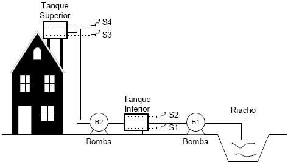

## Projeto 4 - Projeto e Verificação em Verilog

Considere a seguinte figura:

  

A bomba d’água B1 leva água de um riacho até o tanque inferior, e a bomba B2 leva água do tanque inferior para o superior. A bomba B1 deve ligar com o objetivo de encher o tanque inferior, sendo desligada quando a água atingir o nı́vel máximo (S2), e assim permanecendo (desligada) até que a água fique abaixo do nı́vel de mı́nimo (S1). A bomba B2 funciona da mesma forma, baseada nos nı́veis S3 e S4, mas não poderá funcionar caso o nı́vel do tanque inferior esteja abaixo de S1. Se qualquer combinação que os sensores enviarem for impossı́vel de ocorrer na prática, as duas bombas devem ser imediatamente desligadas, independente de qualquer outra situação.

Utilizando uma ou mais FSMs, uilizando Verilog como método de entrada, faça a sı́ntese do circuito correspondente. Obtenha um arquivo de testbench para validação do projeto desenvolvido.

Entregar arquivos de projeto no Modelsim.
